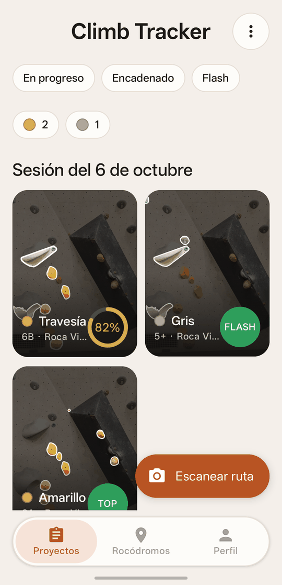
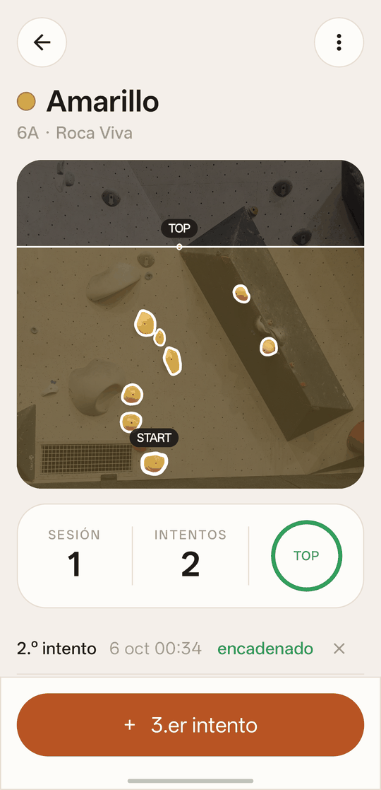
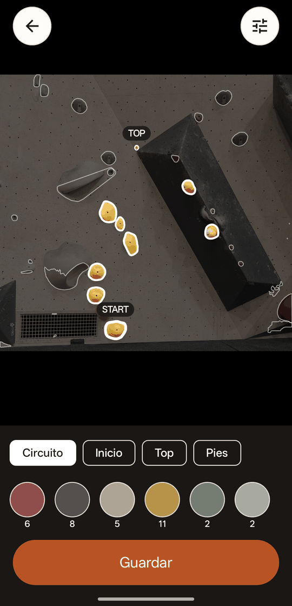
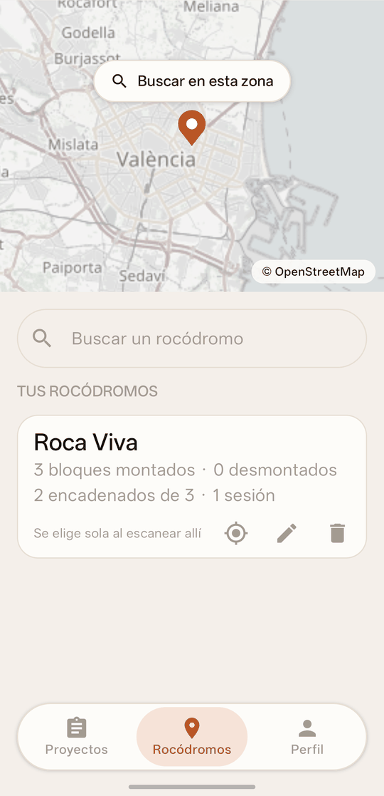
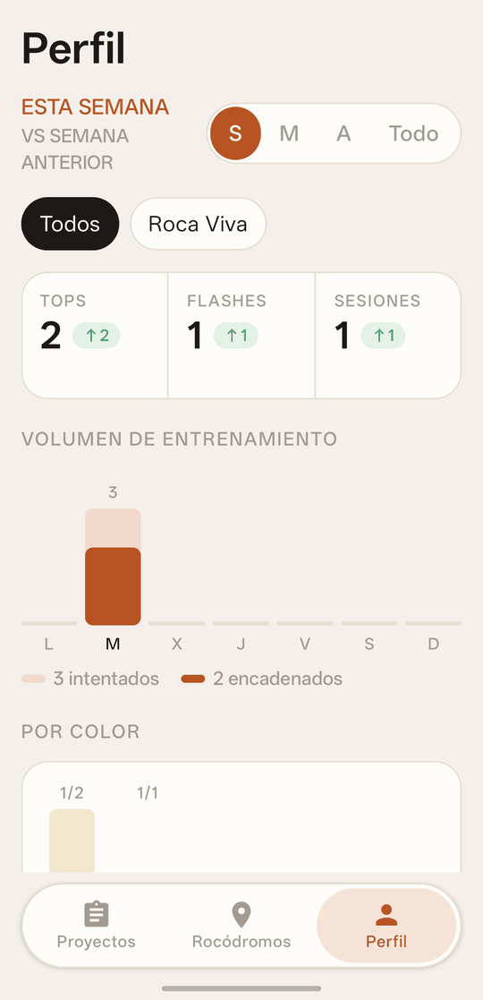

# Climb Tracker

App Android para llevar el registro de tus bloques de boulder a partir de fotos de la pared. Haces una foto, la app detecta las presas, eliges las de tu bloque por color y vas apuntando hasta dónde llegas en cada intento.

Tus bloques, fotos e intentos se quedan en el móvil y no hace falta cuenta. La detección de presas se hace en el propio dispositivo. Solo el mapa de rocódromos usa Internet, y el permiso de ubicación es opcional.

## Capturas

Los datos de las capturas son de ejemplo.

| Proyectos | Bloque | Editor | Rocódromos | Perfil |
|:---:|:---:|:---:|:---:|:---:|
|  |  |  |  |  |

## Qué hace

- **Detecta las presas** de una foto de la pared, en el propio dispositivo.
- **Circuito por color**: toca un color de la paleta, o una presa, y se seleccionan todas las de ese color.
- **Pulsación larga** para añadir o quitar una presa suelta, o para crear una donde no se detectó ninguna.
- **Inicio, top y pies** marcados sobre la foto; las presas solo de pies no cuentan para el progreso.
- **Intentos con progreso**: al registrar un intento eliges la última presa que alcanzaste. La app calcula el porcentaje completado por altura entre el inicio y el top; tocar la presa de top cuenta como encadenado.
- **Varios bloques por foto**: una pared escaneada se reutiliza para tantos bloques como quieras, y sus presas se pueden volver a detectar con otra sensibilidad sin perder los bloques.
- **Perfil con estadísticas**: tops, flashes y sesiones por semana, mes o año; volumen por día; desglose por color y por grado; constancia y récords.
- **Bloques desmontados**: salen de tu lista cuando el rocódromo los quita, pero conservan su historial.
- **Rocódromos**: cada pared se asigna a un rocódromo; hay una pestaña con el resumen de cada uno y las estadísticas del perfil se pueden filtrar por rocódromo.
- **Rocódromo por ubicación**: con el permiso de ubicación, la app recuerda dónde está cada rocódromo y lo elige sola al escanear una pared allí. La posición no sale del teléfono.
- **Mapa de rocódromos**: un mapa de OpenStreetMap para buscarlos por nombre o por zona, añadirlos con su posición o usarlos como ubicación de uno que ya tengas.
- **Compartir** un bloque como imagen vertical: la foto con el circuito, el resultado en grande, el rocódromo, la fecha y los intentos. Se puede cambiar la foto por una tuya y elegir la alineación del texto.
- **Copia de seguridad**: exporta todos los datos y fotos a un archivo y restáuralos en otro móvil.

La app está en español y en inglés, y sigue el tema claro u oscuro del móvil. Usa el primer idioma del móvil en el que esté traducida; se puede fijar otro en los ajustes del sistema, en «Idioma de la app» (Android 13 o superior).

## Instalación

Descarga el APK de la [última release](https://github.com/WekarXD/Climb-Tracker/releases/latest) y ábrelo en un móvil con Android 8.0 o superior y procesador ARM de 64 bits, que son casi todos los vendidos desde 2017. En un móvil de 32 bits o en un emulador x86 no se instala. Hay que permitir la instalación de apps de origen desconocido.

Los APK se firman siempre con la misma clave, así que cada versión se instala encima de la anterior y conserva los datos. Hasta la 2.3.0 eran compilaciones de depuración (de ahí el `-debug` del nombre); las siguientes son de release, más pequeñas y rápidas, y se instalan igualmente encima de aquellas.

## Cómo se usa

1. **Escanear ruta** → haz una foto o elige una de la galería.
2. **Encuadra la pared** arrastrando las esquinas para dejar fuera suelo y techo, y pulsa **Detectar**. Si la foto está hecha de lado o desde abajo, activa **Perspectiva** y lleva cada esquina a una esquina de la pared: la foto se endereza antes de detectar.
3. En el editor, toca el color de tu bloque. Corrige con pulsaciones largas y marca **Inicio**, **Top** y **Pies** con las herramientas de abajo.
4. **Guardar** con nombre y grado.
5. En el bloque, pulsa **+ intento** y toca la última presa que alcanzaste.
6. En el menú del bloque, **Asignar rocódromo**. Las paredes siguientes lo heredan, o lo eligen solas por ubicación.

Sale mejor con una foto de frente a un tramo de pared, sin gente delante.

## Cómo detecta las presas

Las presas y sus colores se encuentran con visión clásica por color; un modelo de segmentación local afina después los contornos. Todo ocurre en el móvil, sin conexión.

1. Estima el **fondo local** de cada zona con una mediana de ventana grande, de modo que una pared con paneles claros y oscuros se trata bien.
2. Marca como presa lo que se aparta de su fondo en color, o lo suficiente en luminosidad. El umbral de luminosidad es asimétrico: más sensible a lo oscuro sobre claro (presas grises) que a lo claro sobre oscuro (magnesio en paneles negros).
3. Agrupa los colores para formar la paleta y separa las presas vecinas de distinto color. Una presa de color absorbe los píxeles vecinos de su mismo tono aunque estén apagados por la sombra o el magnesio.
4. Une los trozos contiguos del mismo material, como las caras de un volumen.
5. Descarta lo demasiado pequeño, lo demasiado grande y los restos de pared en las juntas entre paneles.
6. Descarta lo que no es presa por su entorno: tornillos y brillos dentro de una presa, y las filas de letras pintadas en un panel.
7. Busca aparte las presas del color de la pared, que por color no se ven: las delata su relieve, porque la sombra dibuja casi todo su contorno.
8. Redibuja el contorno de cada presa con un modelo de segmentación (MobileSAM) que se ejecuta en el móvil: se le indica dónde está la presa y devuelve su silueta. Los colores siguen siendo los del detector.

### Limitaciones conocidas

- Las presas del color de la pared (gris claro o blancas sobre pared clara) se detectan por su sombra, con un contorno aproximado que a veces abarca una presa vecina. Si alguna no sale, se añade con pulsación larga.
- Rejillas, personas, pegatinas y algún borde de panel pueden salir marcados como presa.
- Las fotos con perspectiva muy forzada empeoran el resultado, aunque se enderecen al encuadrar: las presas lejanas quedan con menos detalle.
- Los umbrales están ajustados con fotos de un solo rocódromo. El control de sensibilidad del editor permite corregirlo en otras condiciones de luz.

## Privacidad

- La app no tiene cuenta, anuncios ni analítica, y no envía tus bloques ni tus fotos a ningún sitio.
- **Internet** solo lo usa la pestaña de rocódromos: el mapa descarga sus teselas de OpenStreetMap y las búsquedas consultan Nominatim, Photon y Overpass, que reciben el texto buscado o la zona del mapa.
- **Ubicación**: se pide una sola vez, al asignar un rocódromo, y es opcional. Se usa para saber en qué rocódromo estás y para ordenar por distancia; solo se guarda la posición de cada rocódromo, en el teléfono y en tu copia de seguridad.

## Estructura del proyecto

```
core/   Kotlin puro, sin dependencias de Android
        detection/  detector de presas
        editor/     lógica del circuito y presa bajo el dedo
        tracker/    estado, progreso, estadísticas, grados
        image/      utilidades de imagen
app/    Aplicación Android (Jetpack Compose)
        data/       base de datos Room, repositorio, copia de seguridad y búsqueda de rocódromos
        ui/         pantallas
docs/   Documento de diseño y capturas de pantalla
fotos-referencia/      Fotos de paredes reales, recortadas, que usan los tests del detector
fotos-entrenamiento/   Fotos propias para entrenar (carpeta ignorada por git)
```

La lógica vive en `core` para poder probarla en el PC sin móvil ni emulador.

## Compilar

Requisitos: JDK 17 y el Android SDK con sus licencias aceptadas. La compilación descarga sola la plataforma y las herramientas que necesita (hoy, Android 37). La ruta del SDK va en un archivo `local.properties` en la raíz:

```properties
sdk.dir=C\:\\Users\\tu-usuario\\Android\\Sdk
```

La compilación descarga también los dos modelos de segmentación (unos 32 MB) a `app/src/main/assets`. No están en el repositorio: van adjuntos a la release `models-1`. Solo ocurre la primera vez o cuando cambia el modelo.

Ejecutar los tests:

```bash
./gradlew :core:test :app:testDebugUnitTest
```

Generar el APK de depuración, que queda en `app/build/outputs/apk/debug/`:

```bash
./gradlew :app:assembleDebug
```

`./gradlew :app:assembleRelease` genera el que se publica, reducido con R8. Compilado en local se firma con la clave de depuración de la máquina, así que no se instala encima de uno publicado.

Pasar Android Lint: `./gradlew :app:lintDebug`.

Para probar un cambio en un móvil sin tocar los bloques que tiene guardados, `-Ppruebas` compila una copia que se instala junto a la app, con sus propios datos y el nombre «Climb Tracker (pruebas)»:

```bash
./gradlew :app:assembleRelease -Ppruebas
```

Los tests del detector sobre fotos reales dejan en `core/build/detection/` una imagen por foto con las presas contorneadas, útil para revisar a ojo cualquier cambio en la detección. Los de calidad comparan con presas anotadas a mano, antes y después del modelo de segmentación, que se ejecuta también en el PC; sus imágenes quedan en `core/build/quality/`.

## Publicar una versión

Las versiones las compila y publica GitHub Actions:

1. Sube `versionCode` y `versionName` en `app/build.gradle.kts` y confírmalo en `main`.
2. Crea y empuja una etiqueta con ese mismo número, por ejemplo `git tag v2.0.0 && git push origin v2.0.0`. También vale crear la release desde GitHub con esa etiqueta.

El flujo `Release` ejecuta los tests y lint, compila el APK de release y lo adjunta a la release de esa etiqueta. Falla si la etiqueta no coincide con `versionName`.

Para que cada APK se instale encima del anterior, el flujo firma con un almacén de claves guardado en los secretos del repositorio: `SIGNING_KEYSTORE_BASE64` (el archivo en base64) y `SIGNING_STORE_PASSWORD`. Si el alias no es `climbtracker` o la clave tiene otra contraseña, se indican en `SIGNING_KEY_ALIAS` y `SIGNING_KEY_PASSWORD`. Sin el almacén de claves el flujo falla, porque un APK con otra firma no actualizaría instalaciones anteriores.

El flujo `CI` ejecuta los mismos tests y lint en cada cambio de `main` y en cada pull request. Dependabot propone cada mes las actualizaciones de bibliotecas y de acciones.

## Tecnología

Kotlin, Jetpack Compose (Material 3), Room, Navigation Compose, osmdroid para el mapa y ONNX Runtime para el modelo de segmentación. Tests con `kotlin.test` en `core` y Robolectric para la base de datos, la copia de seguridad y la búsqueda de rocódromos.

## Estado y planes

Proyecto personal en desarrollo; la versión estable es la de la [última release](https://github.com/WekarXD/Climb-Tracker/releases/latest). Lo pendiente está organizado en [hitos](https://github.com/WekarXD/Climb-Tracker/milestones) e [issues](https://github.com/WekarXD/Climb-Tracker/issues).

## Licencia

El código de este repositorio se publica bajo la [licencia MIT](LICENSE).

Usa piezas de terceros, cada una con su propia licencia:

- **MobileSAM**, el modelo de segmentación que descarga la compilación: Apache-2.0.
- **ONNX Runtime**, que lo ejecuta en el móvil: MIT.
- **osmdroid**, el visor del mapa: Apache-2.0.
- **OpenStreetMap**: los datos del mapa y de las búsquedas son © los colaboradores de OpenStreetMap, bajo ODbL.
- **Jetpack Compose, Room y el resto de AndroidX**: Apache-2.0.

Las fotos de `fotos-referencia/` son del autor y se incluyen solo para los tests del detector.
